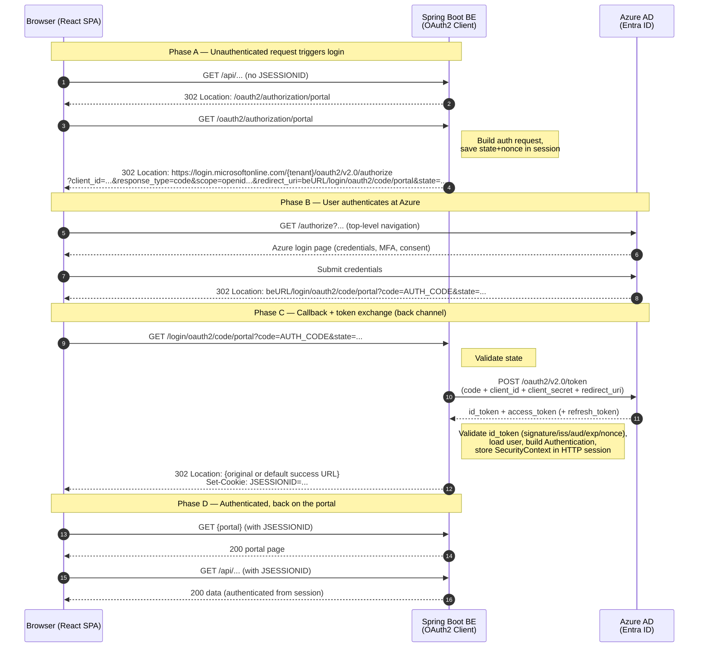

# KT Docs — Azure AD (Entra ID) Login Flow

Knowledge-transfer document for the authentication flow used by the portal.

- **Frontend:** React (Vite) single-page app
- **Backend:** Spring Boot + Spring Security
- **Identity Provider:** Microsoft Entra ID (Azure AD)
- **Azure app registration type:** **Web** (confidential client — has a client secret)
- **Login protocol:** OAuth 2.0 **Authorization Code Flow** via Spring Security `oauth2Login`
- **Session model:** server-side **HTTP session** identified by the **`JSESSIONID`** cookie

> The Azure registration uses the Spring registration id **`portal`**. That id is what produces the two URLs you see in the flow: `/oauth2/authorization/portal` (start login) and `/login/oauth2/code/portal` (callback).

---

## 1. Actors

| Actor | Role |
|-------|------|
| **Browser / React SPA** | Runs the UI. Calls backend APIs. Follows HTTP redirects during login. |
| **Spring Boot Backend (BE)** | Hosts the APIs and acts as the **OAuth2 client**. Drives the login, exchanges the code for tokens, and owns the session. |
| **Azure AD (Entra ID)** | The **Authorization Server / Identity Provider**. Authenticates the user and issues the authorization code + tokens. |

---

## 2. Key concept — why a redirect happens

The backend is a **stateful, session-based** OAuth2 client. A user is "logged in" when the BE holds an authenticated `SecurityContext` in their HTTP session, and the browser holds the matching **`JSESSIONID`** cookie.

When a request arrives **without a valid `JSESSIONID`** (no session, or expired), Spring Security cannot authenticate it. Because the endpoint requires authentication, Spring Security's `AuthenticationEntryPoint` responds with a **302 redirect to `/oauth2/authorization/portal`**, which kicks off the Azure login dance.

This is the standard **OAuth2 Authorization Code Flow** for a confidential (Web) client:
1. BE sends the browser to Azure to log in.
2. Azure sends the browser back to the BE with a short-lived **authorization code**.
3. BE exchanges that code **server-to-server** (using its client id + secret) for an **ID token** + **access token**.
4. BE creates the session and sends the user back to the portal.

The browser **never sees the client secret or the tokens** — they live on the BE only. The browser only carries the opaque `JSESSIONID`.

---

## 3. End-to-end sequence diagram



---

## 4. Step-by-step narration

### Phase A — An unauthenticated request triggers login
1. The browser calls a protected backend URL (an API call, or a top-level navigation) **without a valid `JSESSIONID`**.
2. Spring Security has no authenticated session, so its `AuthenticationEntryPoint` returns **`302 → /oauth2/authorization/portal`**.
3. The browser follows the redirect to `beURL/oauth2/authorization/portal`.
4. Spring Security's `OAuth2AuthorizationRequestRedirectFilter` builds the authorization request, **saves `state` + `nonce` in the session** (CSRF / replay protection), and returns **`302`** to the Azure **`/authorize`** endpoint. The redirect URL carries `client_id`, `response_type=code`, the requested `scope` (e.g. `openid profile email`), the `state`, and **`redirect_uri = beURL/login/oauth2/code/portal`**.

### Phase B — The user logs in at Azure
5. The browser opens the Azure `/authorize` URL. **This must be a full top-level browser navigation**, not a background `fetch` (see §7).
6. Azure renders its login page; the user enters credentials and completes MFA / consent if required.
7. On success, Azure redirects the browser back to the **registered redirect URI**: `beURL/login/oauth2/code/portal?code=AUTH_CODE&state=...`. The `code` is short-lived and single-use.

### Phase C — The backend exchanges the code for tokens (back channel)
8. The browser hits `beURL/login/oauth2/code/portal`. Spring Security's `OAuth2LoginAuthenticationFilter` handles it and **validates `state`** against the value stored in the session.
9. The BE makes a **server-to-server** `POST` to Azure's **token endpoint**, sending `code` + `client_id` + **`client_secret`** + `redirect_uri`. (This is why the registration must be a **Web** confidential client.)
10. Azure returns the **`id_token`** + **`access_token`** (and a `refresh_token` if `offline_access` was requested).
11. The BE **validates the `id_token`** — signature (via Azure JWKS), `iss`, `aud`, `exp`, and `nonce` — loads the user (`OidcUserService`), builds an `OAuth2AuthenticationToken`, and **stores the `SecurityContext` in the HTTP session**. It issues `Set-Cookie: JSESSIONID=...`.
12. The BE returns **`302`** to the originally requested URL (saved by `savedRequest`) or to the configured default success URL — i.e. **back to the portal**.

### Phase D — Authenticated
13. The browser now holds the `JSESSIONID` cookie. Every subsequent request includes it, and Spring Security authenticates each request from the session — **no more redirects** until the session expires or the user logs out.

---

## 5. The endpoints (Spring Security defaults for registration id `portal`)

| URL | Owner | Purpose |
|-----|-------|---------|
| `/oauth2/authorization/portal` | BE (Spring) | **Start** login. Builds the auth request and redirects to Azure. |
| `/login/oauth2/code/portal` | BE (Spring) | **Callback** / redirect URI. Receives the code, exchanges it for tokens. **This exact URL must be registered in Azure** as a Redirect URI. |
| `https://login.microsoftonline.com/{tenant}/oauth2/v2.0/authorize` | Azure | Authorization endpoint (user-facing login). |
| `https://login.microsoftonline.com/{tenant}/oauth2/v2.0/token` | Azure | Token endpoint (back-channel code→token exchange). |

> Changing the registration id (e.g. from `portal` to something else) changes **both** the `/oauth2/authorization/{id}` and `/login/oauth2/code/{id}` paths, and the registered Azure redirect URI must match.

---

## 6. Backend configuration (reference)

### `application.yml`
```yaml
spring:
  security:
    oauth2:
      client:
        registration:
          portal:                       # registration id -> /oauth2/authorization/portal
            client-id: ${AAD_CLIENT_ID}
            client-secret: ${AAD_CLIENT_SECRET}   # required: Web (confidential) app
            authorization-grant-type: authorization_code
            scope:
              - openid
              - profile
              - email
            # redirect-uri defaults to: {baseUrl}/login/oauth2/code/{registrationId}
            # i.e. beURL/login/oauth2/code/portal
        provider:
          portal:                       # matches the registration's provider
            # Azure metadata document — Spring auto-discovers authorize/token/jwks URLs
            issuer-uri: https://login.microsoftonline.com/${AAD_TENANT_ID}/v2.0
```

### `SecurityConfig`
```java
@Configuration
@EnableWebSecurity
public class SecurityConfig {

    @Bean
    SecurityFilterChain filterChain(HttpSecurity http) throws Exception {
        return http
            .authorizeHttpRequests(auth -> auth
                .requestMatchers("/api/public/**", "/actuator/health").permitAll()
                .anyRequest().authenticated()
            )
            // turns on the whole flow documented above
            .oauth2Login(Customizer.withDefaults())
            .logout(logout -> logout
                .logoutSuccessUrl("/")
                .deleteCookies("JSESSIONID")
            )
            .build();
    }
}
```

---

## 7. Frontend (React / Vite) considerations — read this

These are the gotchas that trip people up because the SPA and the BE behave differently from a classic server-rendered app.

### 7.1 Login must be a top-level navigation, not a background `fetch`/XHR
A cross-origin **302 to Azure cannot be followed by `fetch`/`axios`**. The browser turns a cross-origin redirect on an XHR into an **opaque** response, and CORS blocks reading it. So when the SPA detects "not logged in", it must hand the browser over with a **full-page navigation**, e.g.:

```js
// when an API call returns 401 / indicates no session:
window.location.href = `${BE_URL}/oauth2/authorization/portal`;
```

It must **not** try to drive the Azure login via `axios.get(...)`.

### 7.2 Detecting "not logged in"
Because the unauthenticated response is a 302 (which XHR can't follow), it is common to configure the BE so that **API** calls return **`401`** instead of redirecting, and reserve the redirect for top-level navigations. The SPA then reacts to `401` by doing the `window.location` navigation in §7.1. (Spring's entry point can be customized to return `401` for `XMLHttpRequest` / `Accept: application/json` requests.)

### 7.3 Cookies across origins (dev vs prod)
- The browser only sends `JSESSIONID` back to the BE if cookie rules allow it.
- **Same-origin in prod (recommended):** serve the SPA and the BE under the **same origin** (reverse proxy / same domain). Then `JSESSIONID` is first-party and "just works".
- **Different origins (typical Vite dev, e.g. `:5173` FE vs `:8080` BE):** you need
  - BE **CORS** config allowing the FE origin with **`allowCredentials = true`**,
  - FE requests sending credentials: `axios` → `withCredentials: true` (or `fetch` → `credentials: 'include'`),
  - the session cookie attributes set appropriately (`SameSite=None; Secure` over HTTPS for true cross-site).
  - The cleanest dev option is to **proxy** `/api`, `/oauth2`, `/login` from the Vite dev server to the BE so everything is same-origin.

### 7.4 CSRF
Session-cookie auth is susceptible to CSRF. If the app keeps Spring's CSRF protection on, the SPA must read the CSRF token (commonly via the `XSRF-TOKEN` cookie with `CookieCsrfTokenRepository`) and echo it back in the `X-XSRF-TOKEN` header on state-changing requests.

---

## 8. Logout (brief)
- Hitting the BE logout endpoint (`POST /logout` by default) clears the server session and the `JSESSIONID` cookie → the user is unauthenticated locally.
- This is a **local** logout. The Azure / browser SSO session may still be active, so the next `/oauth2/authorization/portal` can log the user back in **without** re-prompting. For a full sign-out, configure **OIDC RP-Initiated Logout** (`OidcClientInitiatedLogoutSuccessHandler`) to also redirect to Azure's `end_session_endpoint`.

---

## 9. Common gotchas / troubleshooting

| Symptom | Likely cause |
|---------|--------------|
| Redirect loop between BE and Azure | Session cookie not being stored/sent (cross-origin cookie blocked, `SameSite`, missing `withCredentials`). |
| `AADSTS50011: redirect URI mismatch` | The Azure app registration's Redirect URI ≠ `beURL/login/oauth2/code/portal` exactly (scheme/host/port/path). |
| CORS error when starting login | SPA tried to `fetch` the login URL instead of a top-level `window.location` navigation (§7.1). |
| `401` on every API call after login | `JSESSIONID` not sent (missing `withCredentials` / `credentials: 'include'`, or cross-site cookie blocked). |
| `[invalid_state_parameter]` on callback | Session was lost between the authorize redirect and the callback (e.g. cookie not persisted, load balancer without sticky sessions). |
| Works in dev, fails in prod | Origin/cookie/`SameSite`/`Secure` differences between the Vite dev proxy and the prod deployment. |

---

## 10. Glossary

- **Authorization Code Flow** — OAuth2 flow where the client first gets a short-lived `code` via the browser, then exchanges it for tokens over a secure back channel.
- **Confidential client / Web app** — an OAuth2 client that can keep a secret (the `client_secret`). Required for the back-channel token exchange.
- **`registrationId` (`portal`)** — Spring's name for one configured OAuth2 client; it shapes the `/oauth2/authorization/{id}` and `/login/oauth2/code/{id}` URLs.
- **ID token** — a signed JWT proving who the user is (OIDC).
- **Access token** — a token authorizing calls to APIs/resources.
- **`JSESSIONID`** — the cookie identifying the user's server-side HTTP session on the BE.
- **`state` / `nonce`** — anti-CSRF / anti-replay values carried through the flow and validated by the BE.

---

## 11. Proposal — Migrating to stateless (JWT) authentication

> **Suggestion.** The current design is **session-based**: the BE keeps the `SecurityContext` in an `HttpSession` and the browser carries a `JSESSIONID` cookie. That is stateful — it needs sticky sessions or a shared session store to scale horizontally, carries a CSRF surface, and makes cross-origin cookies awkward for the SPA. Moving to **stateless, token-based** auth (a signed **JWT** bearer token validated on every request) removes server-side session state, scales with zero shared state, and is the natural fit for an SPA + API (and future mobile) surface.

### 11.1 Two ways to do it

| Option | Who issues the token | BE role | SPA change | Recommendation |
|--------|----------------------|---------|------------|----------------|
| **A — Azure tokens + Resource Server** | **Azure AD** issues a JWT access token | **Resource Server**: validates Azure JWT | Add **MSAL.js** (Auth Code + PKCE), send `Authorization: Bearer` | **Recommended** — leverages Azure directly, no custom token issuer |
| **B — BE-minted JWT** | **Your BE** mints its own JWT after the Azure login | Login broker **+** Resource Server for its own token | Minimal (store + send bearer) | Use only if you must hide Azure from the SPA |

The rest of this section details **Option A**. Option B is sketched in §11.6.

### 11.2 Target flow (Option A)

The browser talks to Azure **directly** to get tokens (public client, PKCE — no client secret in the SPA). The BE never does a redirect; it only **validates** the bearer token on each call. No `JSESSIONID`, no `HttpSession`.

```mermaid
sequenceDiagram
    autonumber
    participant B as Browser (React + MSAL)
    participant AAD as Azure AD (Entra ID)
    participant BE as Spring Boot BE<br/>(Resource Server)

    Note over B,AAD: One-time login — SPA gets tokens directly (Auth Code + PKCE)
    B->>AAD: /authorize (PKCE challenge, scope=api://&lt;api-id&gt;/access_as_user)
    AAD-->>B: authorization code
    B->>AAD: /token (code + PKCE verifier)
    AAD-->>B: access_token (JWT) + id_token + refresh_token

    Note over B,BE: Every API call — stateless, no session
    B->>BE: GET /api/... — Authorization: Bearer &lt;JWT&gt;
    Note right of BE: Validate signature via Azure JWKS,<br/>check iss / aud / exp / scope — no session lookup
    BE-->>B: 200 data

    Note over B,AAD: Token near expiry → MSAL refreshes silently
    B->>AAD: acquireTokenSilent (refresh_token)
    AAD-->>B: new access_token
```

### 11.3 Azure AD registration changes

1. **SPA app registration** (public client): add a **Single-page application** platform with redirect URI = the SPA origin (e.g. `https://portal.example.com`). PKCE is implicit for SPA platform; no secret.
2. **API app registration** (can be the existing BE registration): **Expose an API** → set the Application ID URI `api://<api-client-id>` → add a scope **`access_as_user`**.
3. Give the SPA permission to that scope (**API permissions** → add the `access_as_user` scope → grant consent).
4. (Optional) define **App roles** on the API registration if you want role-based authorization; they arrive in the token's `roles` claim.

### 11.4 Backend config (the meat)

**Dependency** — swap the OAuth2 *client* starter for the *resource server* starter (or run both during migration):

```groovy
// build.gradle
implementation 'org.springframework.boot:spring-boot-starter-oauth2-resource-server'
```

**`application.yml`** — point at your tenant's issuer; Spring auto-discovers the JWKS and validates `iss`/signature. `audiences` pins the token to your API:

```yaml
spring:
  security:
    oauth2:
      resourceserver:
        jwt:
          # Azure AD v2 issuer for your tenant
          issuer-uri: https://login.microsoftonline.com/${AAD_TENANT_ID}/v2.0
          # audience check (Spring Boot 3.1+): reject tokens not minted for this API
          audiences:
            - api://${AAD_API_CLIENT_ID}
```

**`SecurityConfig`** — stateless, bearer-validated, CSRF off (no cookies), CORS on:

```java
@Configuration
@EnableWebSecurity
public class SecurityConfig {

    @Bean
    SecurityFilterChain api(HttpSecurity http) throws Exception {
        return http
            .securityMatcher("/api/**")
            .cors(Customizer.withDefaults())
            .csrf(csrf -> csrf.disable())                       // no cookies → no CSRF vector
            .sessionManagement(sm -> sm
                .sessionCreationPolicy(SessionCreationPolicy.STATELESS))
            .authorizeHttpRequests(auth -> auth
                .requestMatchers("/api/public/**", "/actuator/health").permitAll()
                .anyRequest().authenticated())
            .oauth2ResourceServer(oauth2 -> oauth2
                .jwt(jwt -> jwt.jwtAuthenticationConverter(jwtAuthConverter())))
            .build();
    }

    /** Map Azure 'scp' (delegated scopes) and 'roles' (app roles) to Spring authorities. */
    private JwtAuthenticationConverter jwtAuthConverter() {
        JwtGrantedAuthoritiesConverter scopes = new JwtGrantedAuthoritiesConverter();
        scopes.setAuthorityPrefix("SCOPE_");
        scopes.setAuthoritiesClaimName("scp");                 // Azure delegated scopes claim

        JwtAuthenticationConverter conv = new JwtAuthenticationConverter();
        conv.setJwtGrantedAuthoritiesConverter(jwt -> {
            var authorities = new ArrayList<GrantedAuthority>(scopes.convert(jwt));
            // app roles → ROLE_*
            List<String> roles = jwt.getClaimAsStringList("roles");
            if (roles != null) {
                roles.forEach(r -> authorities.add(new SimpleGrantedAuthority("ROLE_" + r)));
            }
            return authorities;
        });
        return conv;
    }
}
```

That is the whole BE change: **delete `oauth2Login` + the session**, add `oauth2ResourceServer().jwt()` + `STATELESS`. Method-level rules become `@PreAuthorize("hasAuthority('SCOPE_access_as_user')")` etc.

### 11.5 Frontend config (React + MSAL)

```ts
// msalConfig.ts
import { PublicClientApplication } from '@azure/msal-browser';

export const msal = new PublicClientApplication({
  auth: {
    clientId: import.meta.env.VITE_AAD_SPA_CLIENT_ID,                 // SPA registration
    authority: `https://login.microsoftonline.com/${import.meta.env.VITE_AAD_TENANT_ID}`,
    redirectUri: window.location.origin,
  },
  cache: { cacheLocation: 'sessionStorage' },                        // not localStorage (XSS, see 11.7)
});

export const apiScopes = [`api://${import.meta.env.VITE_AAD_API_CLIENT_ID}/access_as_user`];
```

```ts
// api.ts — attach the bearer token to every request
import axios from 'axios';
import { msal, apiScopes } from './msalConfig';

export const api = axios.create({ baseURL: import.meta.env.VITE_API_BASE });

api.interceptors.request.use(async (config) => {
  const account = msal.getActiveAccount();
  const result = await msal.acquireTokenSilent({ scopes: apiScopes, account });  // refreshes if needed
  config.headers.Authorization = `Bearer ${result.accessToken}`;
  return config;
});
```

**CORS** is still needed (cross-origin), but it is now *simpler*: you allow the `Authorization` header and **do not** need `allowCredentials`/cookies.

```java
@Bean
CorsConfigurationSource corsConfigurationSource() {
    CorsConfiguration c = new CorsConfiguration();
    c.setAllowedOrigins(List.of("https://portal.example.com"));
    c.setAllowedMethods(List.of("GET", "POST", "PUT", "PATCH", "DELETE"));
    c.setAllowedHeaders(List.of("Authorization", "Content-Type"));
    c.setAllowCredentials(false);                 // bearer in header, not a cookie
    UrlBasedCorsConfigurationSource s = new UrlBasedCorsConfigurationSource();
    s.registerCorsConfiguration("/api/**", c);
    return s;
}
```

### 11.6 Option B — BE mints its own JWT (alternative)

Keep the existing Azure **login** (code exchange) on the BE, but on success **issue your own signed JWT** instead of creating a session, and return it to the SPA. The BE then also runs as a Resource Server validating *its own* token.

- On login success, build a token with a `JwtEncoder` (Nimbus): `JwtEncoder.encode(...)` signed with an RSA key you own; return it in the response body.
- Resource server config validates that key (`jwtDecoder` built from your public key) instead of Azure's JWKS.
- **Pros:** SPA stays simple (no MSAL); you fully control claims/TTL. **Cons:** you are now a token issuer (key management, rotation), and you no longer use Azure tokens directly.

Prefer **Option A** unless you have a hard requirement to keep Azure invisible to the SPA.

### 11.7 Trade-offs & security caveats (read before committing)

- **Revocation is hard.** A JWT is valid until it expires — you cannot "log it out" server-side. Mitigate with **short access-token TTL (5–15 min)** + silent refresh (MSAL handles it). True revocation needs a server-side denylist, which reintroduces state.
- **Token storage / XSS.** A token reachable from JavaScript can be stolen by an XSS payload. Keep it **in memory / `sessionStorage`**, never `localStorage`, and keep a strict CSP. This is the main security regression versus an `httpOnly` session cookie.
- **Logout** becomes client-side: discard the token and call MSAL `logoutRedirect` for the Azure SSO session. In-flight tokens remain valid until expiry.
- **CSRF largely goes away** (a bearer header is not auto-sent by the browser the way a cookie is), which is why CSRF can be disabled — but the **XSS** risk rises, so the net security depends on your front-end hygiene.
- **Always validate** `iss`, `aud`, `exp`, signature, and the required `scp`/`roles`. Allow small clock skew.
- **Most secure alternative:** if XSS token theft is a top concern, the **BFF (Backend-for-Frontend)** pattern — tokens stay server-side, browser holds only an `httpOnly` cookie — is what Microsoft generally recommends for SPAs. It is *not* stateless, so it is the opposite trade-off from this proposal. Choose based on whether **statelessness/scale** (JWT) or **token-theft resistance** (BFF) matters more.

### 11.8 Suggested migration path (incremental, no big-bang)

1. Add the resource-server `SecurityFilterChain` scoped to `/api/**` **alongside** the existing `oauth2Login` chain (two chains via `securityMatcher`). Nothing breaks yet.
2. Register the SPA + API scope in Azure (§11.3).
3. Add MSAL to the React app; start sending `Authorization: Bearer` on API calls.
4. Run **dual-mode** for a release: session for legacy paths, bearer for `/api/**`. Verify dashboards/metrics.
5. Cut over the SPA fully to bearer; **remove** `oauth2Login`, session management, and CSRF/cookie config.
6. Delete sticky-session / shared-session infrastructure once no session chain remains.
